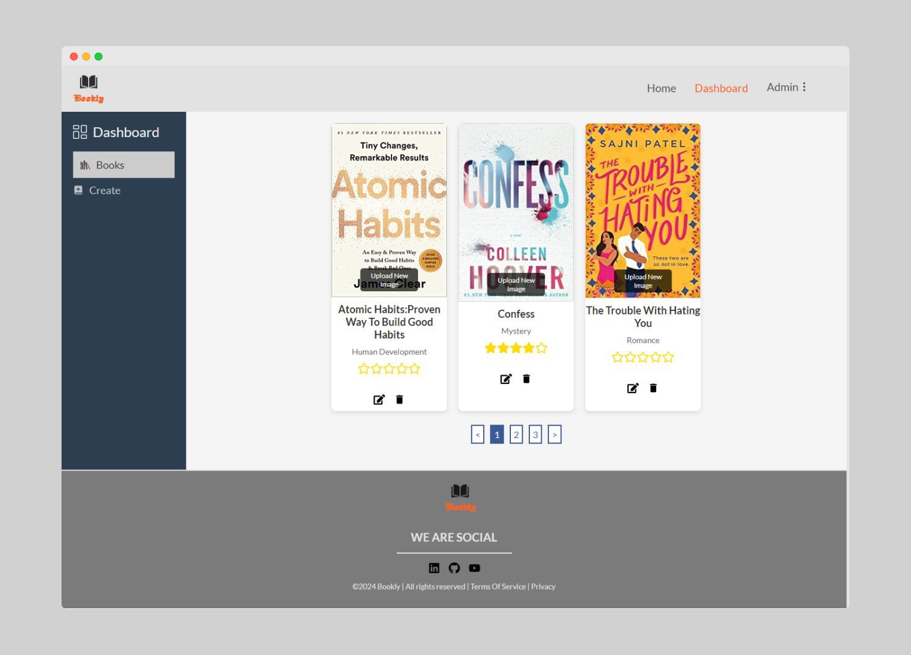
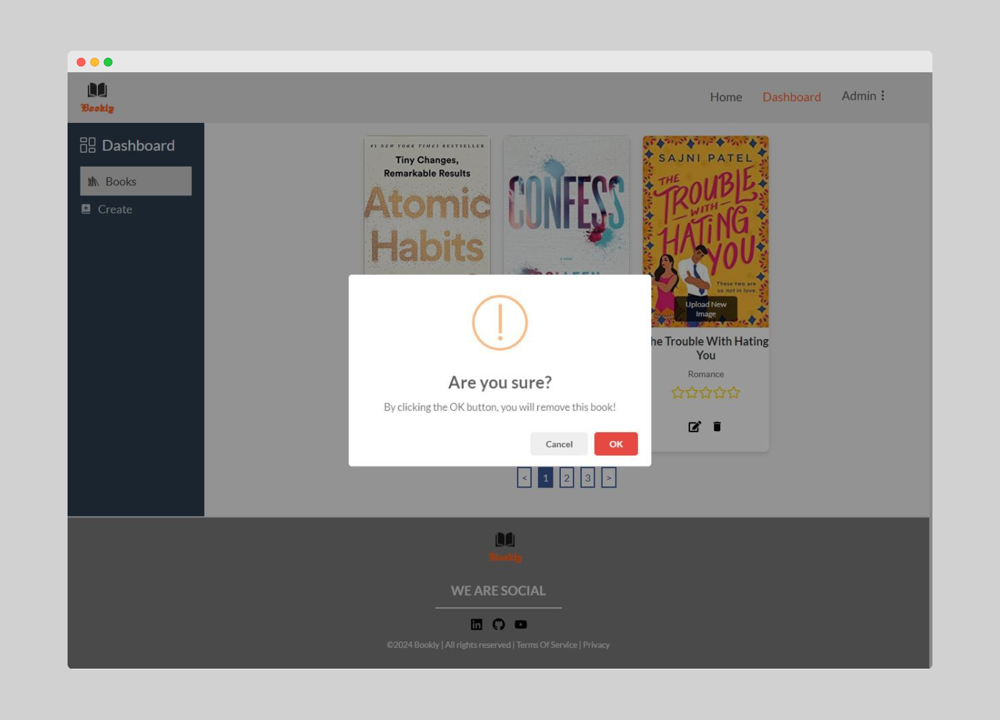
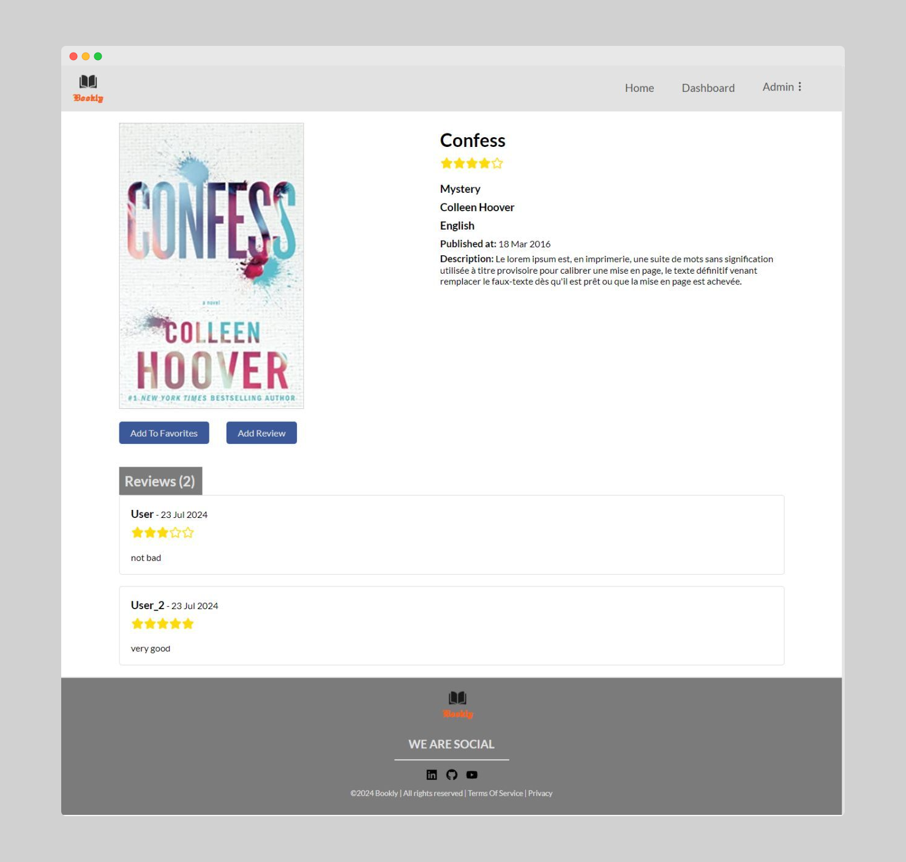
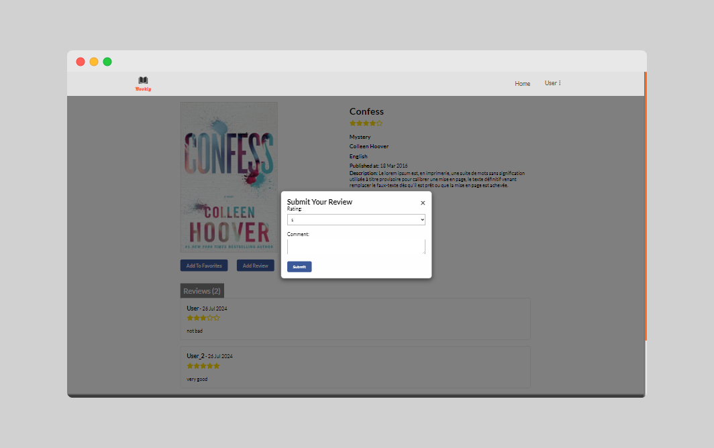
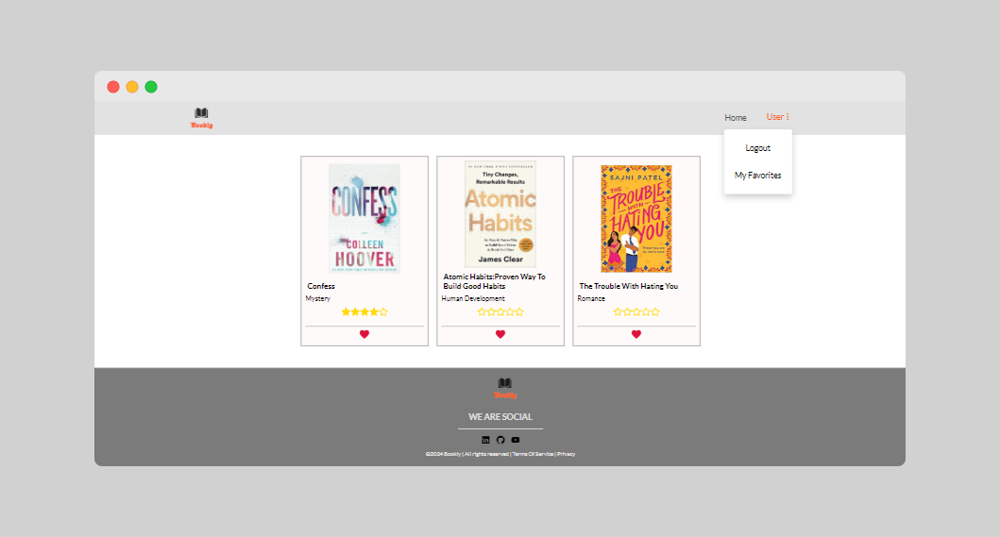

# Bookly
### Bookly: Library Management System using MERN Technologies

## Technologies
-Frontend: React.js – Tailwind CSS – Redux Toolkit
---
-Backend: Node.js – Express.js
---
-Database: MongoDB
***

## Description
The admin has a dashboard that allows them to add, edit, or delete books.

Users can rate a book by adding a score between 1 and 5 and leaving a comment.

Users can add or remove books from their favorite list.
***

## Features
- Creating a comprehensive backend API using Node.js and Express.js.
- Securing routes/endpoints using JWT (JSON Web Tokens).
- Developing the frontend to work seamlessly with the backend API.
- Utilizing pagination to enhance performance, provide a better user experience, manage memory efficiently, and simplify request handling.
- Managing images with Cloudinary.
- Using Redux Toolkit for state management.

I am pleased to share a project demo video available at [the link](https://www.youtube.com/watch?v=H9IEJoS_b64)
***

## Overview

***

***

***

***

***
